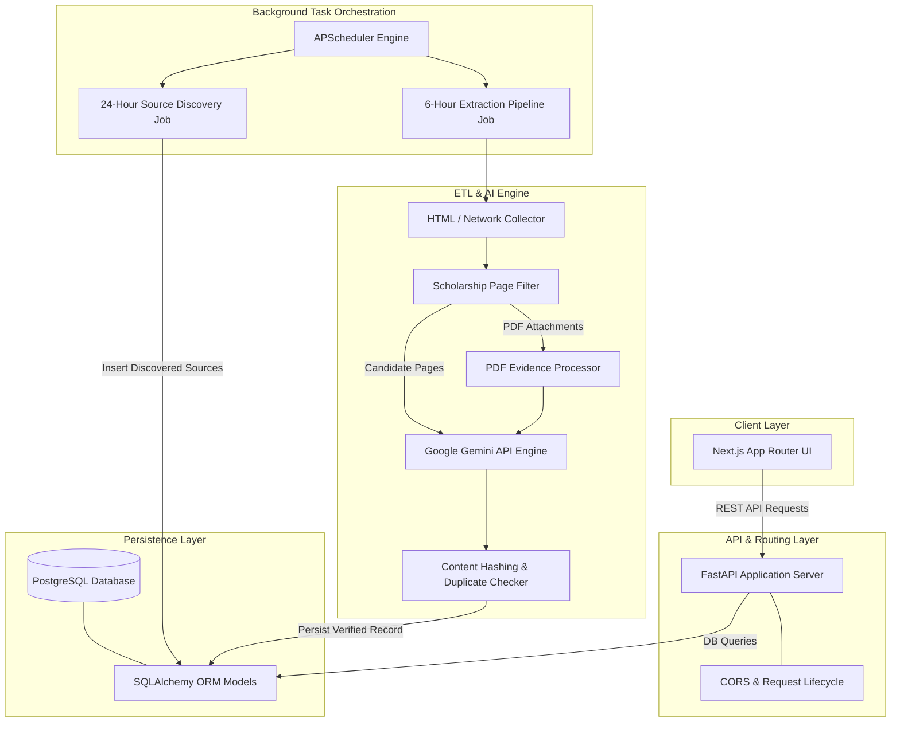
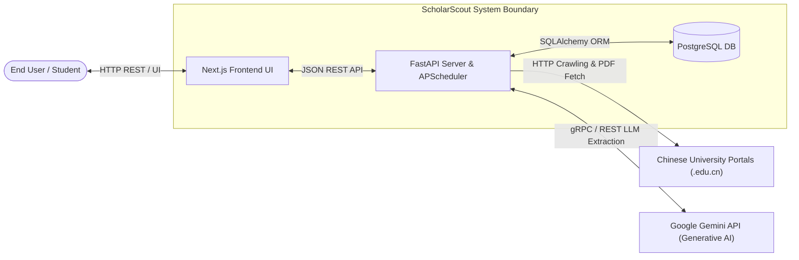
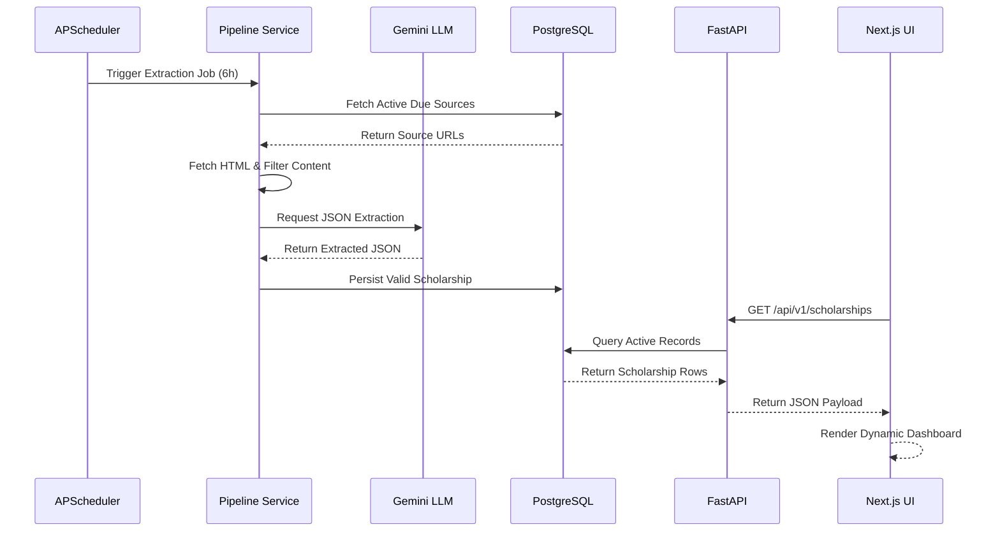

# System Architecture Specification — ScholarScout AI

This document provides a comprehensive technical breakdown of the architecture, component interaction, data flows, subsystem boundaries, and implementation patterns of **ScholarScout AI**. It is designed as an architectural manual for engineers modifying, extending, or refactoring the codebase.

---

## 1. Architecture Overview

ScholarScout AI follows an asynchronous, decoupled multi-layer architecture split between a Next.js (TypeScript) presentation dashboard, a FastAPI (Python) web and REST service, an APScheduler task orchestration layer, an automated ETL and AI extraction pipeline, and a PostgreSQL database persistence layer.

### System Flow Diagram



---

## 2. System Context

The application interacts with external Chinese university web portals (`.edu.cn`), the Google Gemini AI infrastructure for LLM structured parsing, and end-user browsers.



---

## 3. Component Architecture

### Component Inventory

#### 1. Presentation Layer (`frontend/`)
* **Responsibility:** User dashboard, scholarship filtering, search interface, detail view navigation, and interactive stats display.
* **Location:** `frontend/`
* **Dependencies:** Next.js (App Router), React, Tailwind CSS, Lucide React, Shadcn UI (`components/ui`).
* **Inputs:** User search terms, filter toggles, REST API JSON responses.
* **Outputs:** Rendered DOM, dynamic routing, external application redirects.
* **Key Files:** `app/page.tsx`, `app/scholarships/[id]/page.tsx`, `components/scholarships/DashboardClient.tsx`, `services/scholarshipService.ts`.

#### 2. REST API Layer (`backend/app/api/`)
* **Responsibility:** Exposes RESTful endpoints for scholarships, discovery sources, and pipeline execution metrics.
* **Location:** `backend/app/api/routes/`
* **Dependencies:** FastAPI, Pydantic, SQLAlchemy.
* **Inputs:** HTTP GET requests (`/scholarships`, `/scholarships/{id}`, `/sources`, `/scholarships/stats`).
* **Outputs:** Validated JSON responses matching Pydantic schemas.
* **Key Files:** `app/api/routes/scholarships.py`, `app/api/routes/sources.py`, `app/schemas/api.py`.

#### 3. Automation & Scheduler Engine (`backend/app/services/scheduler/`)
* **Responsibility:** Persistent orchestration of periodic discovery and scholarship crawling jobs.
* **Location:** `backend/app/services/scheduler/`
* **Dependencies:** `APScheduler` (`AsyncIOScheduler`), SQLAlchemy `SessionLocal`.
* **Inputs:** Cron / Interval timers (6 hours for extraction, 24 hours for discovery).
* **Outputs:** Executed async background pipeline routines.
* **Key Files:** `app/services/scheduler/service.py`, `app/services/scheduler/discovery_job.py`, `app/main.py`.

#### 4. Pre-Filter Engine (`backend/app/services/filters/`)
* **Responsibility:** Heuristic analysis and regex key-term scoring on raw HTML to eliminate irrelevant pages before LLM invocation.
* **Location:** `backend/app/services/filters/scholarship.py`
* **Dependencies:** BeautifulSoup4, Re (Regex).
* **Inputs:** Raw HTML text strings from crawled sites.
* **Outputs:** Boolean decision (`is_candidate_page`) and relevance scores.
* **Key Files:** `app/services/filters/scholarship.py`.

#### 5. AI Extraction Engine (`backend/app/services/extraction/`)
* **Responsibility:** Constructing structured extraction prompts and parsing unstructured HTML/PDF content via Google Gemini.
* **Location:** `backend/app/services/extraction/`
* **Dependencies:** `google-generativeai`, Pydantic JSON validation rules.
* **Inputs:** Pre-filtered candidate HTML content, extracted PDF text.
* **Outputs:** Structured scholarship dictionary (Title, University, Funding, Degree Level, Deadlines, Requirements).
* **Key Files:** `app/services/extraction/openai_extractor.py` *(uses Gemini engine under the hood)*, `app/services/extraction/pdf_evidence.py`.

#### 6. Persistence & ORM Layer (`backend/app/models/` & `backend/app/database/`)
* **Responsibility:** Relational database mapping, session management, and schema execution.
* **Location:** `backend/app/database/`, `backend/app/models/`
* **Dependencies:** SQLAlchemy, psycopg2-binary, Alembic.
* **Inputs:** Domain data models and ORM objects.
* **Outputs:** Relational rows in PostgreSQL tables.
* **Key Files:** `app/database/database.py`, `app/models/scholarship.py`, `app/models/source.py`.

---

## 4. Application Flow

### Primary Request & Data Processing Lifecycle

```text
End User / Browser
  ↓ HTTP GET /api/v1/scholarships?degree=Master
FastAPI Router (app/api/routes/scholarships.py)
  ↓ Dependency Injection (get_db)
SQLAlchemy DB Session
  ↓ ORM Query Filter
PostgreSQL Database
  ↓ Row Set Result
Pydantic Schema Serialization (app/schemas/api.py)
  ↓ JSON Response
Next.js Client (services/scholarshipService.ts)
  ↓ State Update & React Re-render
User Interface Display
```

### Continuous Extraction Pipeline Lifecycle

```text
APScheduler (Every 6 Hours)
  ↓ Triggers run_scheduled_discovery()
Query Queue in PostgreSQL (Source Model where status='active' AND due for check)
  ↓ HTTP Request / Crawl Portal (HTTPX / Playwright)
HTML Pre-Filter (ScholarshipPageFilter)
  ↓ Candidate HTML Accepted
Gemini AI Extractor (OpenAIExtractor / Gemini API)
  ↓ JSON Output
Duplicate Checker (Repository Hash Lookup)
  ↓ Unique & Valid Record
Persist to DB (Scholarship Model) & Update Source Check Timestamp
```

---

## 5. Frontend Architecture

* **Framework:** Next.js (App Router), TypeScript.
* **Routing:** Dynamic and file-system based (`app/page.tsx`, `app/scholarships/[id]/page.tsx`).
* **Components Layout:**
  * `Navbar.tsx`: Top header, connection status indicator, and navigation branding.
  * `StatsSection.tsx`: Metrics header displaying total active scholarships and scheduler countdown.
  * `DashboardClient.tsx`: Client component holding search state, category filters, and grid rendering.
  * `ScholarshipCard.tsx`: Visual preview cards for individual opportunities.
* **State Management:** React `useState` and `useEffect` within client containers (`DashboardClient`).
* **API Communication:** Isolated service layer in `services/scholarshipService.ts` fetching from `NEXT_PUBLIC_API_BASE_URL`.
* **Error Handling & Fallbacks:** Service layer contains fallback mechanisms importing static mock records (`mock/scholarships.ts`) if the API connection drops or experiences downtime.

---

## 6. Backend Architecture

* **Entry Point:** `backend/app/main.py` instantiates `FastAPI(lifespan=...)`.
* **Lifespan Context Manager:** On startup, creates database tables (`Base.metadata.create_all`) and initializes the background scheduler via `start_scheduler()`. On shutdown, shuts down the scheduler.
* **Routing Structure:**
  * Router instances mounted under prefix `/api/v1`.
  * `/api/v1/scholarships`: Standard query, stats, and detail handlers.
  * `/api/v1/sources`: Processing queue control.
* **Dependency Injection:** `app/dependencies/__init__.py` provides `get_db()` yield session generator for safe transaction scoping.

---

## 7. API Architecture

* **Organization:** Sub-routed REST API located under `backend/app/api/routes/`.
* **Routing Table:**
  * `GET /api/v1/scholarships`: Query list with optional search, degree, funding, and university filters.
  * `GET /api/v1/scholarships/stats`: Returns aggregated pipeline metrics.
  * `GET /api/v1/scholarships/{id}`: Returns full metadata for a specific scholarship.
  * `GET /api/v1/sources`: Lists monitored university source portals.
* **Authentication:** Could not be determined from the codebase.
* **Response Serialization:** Strict response formatting using Pydantic models in `app/schemas/api.py`.

---

## 8. Database Architecture

* **Technology:** PostgreSQL (compatible with managed services such as Supabase, Neon, or Railway).
* **ORM:** SQLAlchemy (Declarative Base).
* **Migration Tool:** Alembic (`migrations/` directory).
* **Primary Models:**
  * **`Scholarship`:** Stores extracted title, university, degree level, funding type, deadline, application URL, AI summary, and requirement rules. Includes content hashing for deduplication.
  * **`Source`:** Stores monitored domain base URLs, site name, scanning status (`active`, `completed`, `error`), checking frequency, error counts, and last checked timestamp.
  * **`SearchLog` / `UserProfile`:** Auxiliary tracking structures.

---

## 9. Authentication Architecture

> Could not be determined from the codebase.  
*Note: The current API endpoints are public REST services without authentication or session protection.*

---

## 10. Business Logic Architecture

### Automated Scholarship Extraction Process

```text
Raw HTML / PDF Link
  ↓
Validation (ScholarshipPageFilter)
  ↓ Excludes non-scholarship news, generic announcements, or low-scoring pages
Gemini AI Parsing (OpenAIExtractor)
  ↓ Prompt contains schema instructions for title, funding, deadlines, and degree
Duplicate Check (DuplicateChecker Repository)
  ↓ Content hash matched against DB records to prevent redundant entries
Database Storage (SQLAlchemy Session)
  ↓ Writes validated record to `scholarships` table
Source Queue Update
  ↓ Updates `last_checked_at` and resets failure counts on `sources` table
```

---

## 11. External Integrations

| Service | Purpose | Integration Point | Failure Behavior |
| :--- | :--- | :--- | :--- |
| **Google Gemini API** | Parsing unstructured web content into JSON metadata | `backend/app/services/extraction/openai_extractor.py` | Catches API errors, logs event, skips page parsing, and increments source retry counter |
| **Chinese University Portals (`.edu.cn`)** | Fetching source announcements & HTML/PDF pages | `backend/app/services/connectors/university.py` & HTTPX/Playwright | Handles timeout, sets source backoff status, logs HTTP exception |

---

## 12. Background Processing

* **Engine:** `APScheduler` (`AsyncIOScheduler`) running concurrently with the Uvicorn event loop inside the FastAPI application process.
* **Jobs Configured:**
  1. **Source Discovery Job (`run_scheduled_source_discovery`):** Runs every 24 hours to locate active university portals.
  2. **Scholarship Extraction Job (`run_scheduled_discovery`):** Runs every 6 hours to process due sources from the queue.
* **Failure & Retry Mechanics:** Retries failed HTTP connections, logs exception backtraces, and updates the `Source` status column with backoff metadata.

---

## 13. Data Flow



---

## 14. Dependency Architecture

* **Core Subsystem:** `backend/app/main.py` binds database initialization, routes, and scheduler services together.
* **High-Coupling Areas:**
  * `ScholarshipPageFilter` and `OpenAIExtractor` are tightly coupled within the pipeline runner execution loop.
  * Frontend components heavily rely on the `Scholarship` type definitions matching the backend Pydantic API schemas.

---

## 15. Configuration Architecture

* **Environment Management:** Powered by Pydantic `BaseSettings` in `backend/app/config/settings.py`.
* **Configured Variables:**
  * `DATABASE_URL`: Connection URI for PostgreSQL.
  * `GEMINI_API_KEY`: Secrets credential for Generative AI API access.
  * `PYTHONPATH`: Base path configuration for Python module importing.
  * `NEXT_PUBLIC_API_BASE_URL`: Public backend API base endpoint exposed to the Next.js client.

---

## 16. Error Handling Architecture

* **API Layer:** FastAPI HTTP exceptions converted into standard JSON error objects with status codes (`404`, `500`).
* **Crawler & Extraction Layer:** Try-except blocks surround network requests and LLM calls. Failures update the respective `Source` entity's failure count without crashing the application process.
* **Frontend Layer:** `scholarshipService.ts` catches network errors and logs them while falling back to mock data structures if available to maintain visual stability.

---

## 17. Security Architecture

### Implemented
* CORS middleware configuration (`CORSMiddleware`) configured in `app/main.py`.
* Environment variable isolation for API keys and database credentials.
* Database ORM parameterization via SQLAlchemy protecting against SQL injection.

### Missing
* Authentication & Authorization layer (no JWT or Session protection on management routes).
* Rate limiting middleware on API routes.

### Potential Risks
* Public exposure of source queue trigger routes without administrative token verification.

---

## 18. Scalability Architecture

* **Current Implementation:** Single-instance FastAPI execution with embedded APScheduler background process.
* **Database Scalability:** Uses PostgreSQL connection pooling via SQLAlchemy engine.
* **Concurrency:** Asynchronous non-blocking network calls via Python `asyncio` and `HTTPX`.
* **Bottlenecks:** Running Playwright or heavy Gemini API parsing synchronously within the scheduler cycle can saturate single-instance memory/CPU quotas.
* **Recommended Scaling Path:** Separate the APScheduler service from the FastAPI web server, offloading extraction tasks to a dedicated Redis + Celery worker queue for high-volume crawling.

---

## 19. Architectural Decisions

1. **Embedded APScheduler in Lifespan:**
   * **Implementation:** `start_scheduler()` runs inside FastAPI's startup event.
   * **Reason:** Ensures zero extra infrastructure overhead (no extra worker container required on small deployments like Koyeb).
2. **LLM Pre-Filtering Step:**
   * **Implementation:** `ScholarshipPageFilter` runs heuristic checks before invoking the Gemini API.
   * **Reason:** Dramatically reduces token consumption and eliminates costs associated with parsing non-scholarship pages.

---

## 20. Safe Modification Guide

| Subsystem | Main Files to Edit | Tests to Run | Database Tables Involved |
| :--- | :--- | :--- | :--- |
| **API Endpoints** | `app/api/routes/` | `tests/test_main.py` | `scholarships`, `sources` |
| **Extraction Logic** | `app/services/extraction/` | `tests/test_pdf_extraction_gemini.py` | `scholarships` |
| **Page Filtering** | `app/services/filters/` | `tests/test_filter.py` | N/A |
| **Scheduler & Crawling** | `app/services/scheduler/` | `tests/test_scheduler.py` | `sources` |
| **UI Dashboard** | `frontend/components/` | Next.js build (`npm run build`) | N/A |

---

## 21. Architecture Summary

### Strengths
* Clear layer separation between UI, REST API, Pipeline, and Storage.
* Highly cost-effective pre-filtering module protecting LLM token limits.
* Built-in deduplication and state backoff for web scrapers.

### Weaknesses
* Embedded background scheduler shares CPU/RAM limits with public REST API endpoints.
* Lack of authentication on write/admin routes.

### Recommended Improvements
1. Add JWT administrative authentication for sensitive endpoints.
2. Separate background scraping workers from the API web server using Celery/Redis if scaling beyond MVP.
