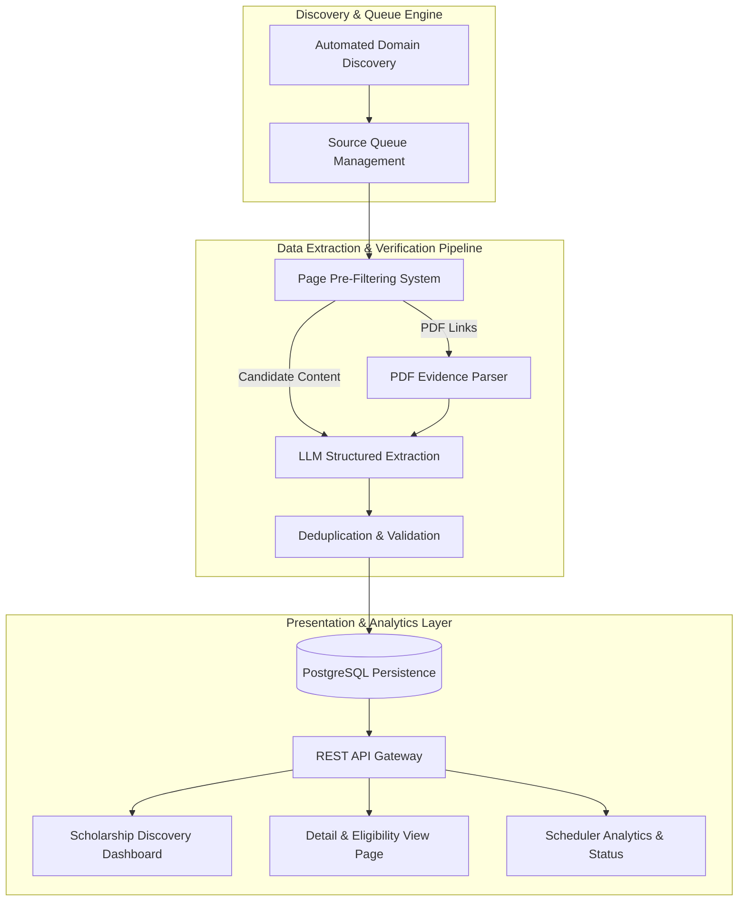

# Feature Architecture & Code Mapping Matrix — ScholarScout AI

This document serves as the technical **Feature-to-Code Blueprint** for **ScholarScout AI**. It maps every major end-user and system feature directly to its frontend components, backend routes, business logic services, database tables, unit test suites, and potential modification points.

---

## Feature Dependency Map



---

## Feature Matrix

| Feature | Frontend | Backend | Database | API Endpoint | Tests | Status |
| :--- | :--- | :--- | :--- | :--- | :--- | :--- |
| **1. Automated Source Discovery** | N/A (Background) | `services/automation/discovery.py` | `sources` | N/A (Scheduler) | `test_automation.py` | Implemented |
| **2. Queue & Backoff Manager** | `Navbar.tsx` | `services/automation/manager.py` | `sources` | `GET /sources` | `test_scheduler.py` | Implemented |
| **3. Page Pre-Filter Engine** | N/A (Pipeline) | `services/filters/scholarship.py` | N/A | N/A (Internal) | `test_filter.py` | Implemented |
| **4. AI Metadata Extractor** | N/A (Pipeline) | `services/extraction/openai_extractor.py` | N/A | N/A (Internal) | `test_pdf_extraction_gemini.py` | Implemented |
| **5. PDF Evidence Parser** | N/A (Pipeline) | `services/pdf/downloader.py`, `evidence_processor.py` | N/A | N/A (Internal) | `test_pdf_evidence_processor.py` | Implemented |
| **6. Deduplication Engine** | N/A (Pipeline) | `services/duplicate_checker/repository.py` | `scholarships` | N/A (Internal) | `test_pipeline.py` | Implemented |
| **7. Scholarship Search & Dashboard** | `DashboardClient.tsx`, `ScholarshipCard.tsx` | `api/routes/scholarships.py` | `scholarships` | `GET /scholarships` | `test_main.py` | Implemented |
| **8. Scholarship Detail View** | `app/scholarships/[id]/page.tsx` | `api/routes/scholarships.py` | `scholarships` | `GET /scholarships/{id}` | `test_main.py` | Implemented |
| **9. Real-Time Scheduler Metrics** | `StatsSection.tsx` | `api/routes/scholarships.py` | `scholarships`, `sources` | `GET /scholarships/stats` | `test_main.py` | Implemented |

---

## Detailed Feature Specifications

### 1. Automated Source Discovery & Seeding
#### Description
Scans Chinese higher-education web domains (`.edu.cn`) every 24 hours to locate active university portal announcements and seed them into the crawling queue.

* **Status:** Implemented
* **Frontend:** None (Runs as a background scheduled job).
* **Backend:** `backend/app/services/automation/discovery.py`, `backend/app/services/scheduler/discovery_job.py`.
* **Database:** Inserts domain entities into the `sources` table.
* **External Services:** Outbound HTTP domain validation to Chinese university web servers.
* **Important Files:**
  * `backend/app/services/automation/discovery.py`
  * `backend/app/services/scheduler/discovery_job.py`
  * `backend/app/scripts/run_discovery.py`
* **Main Workflow:**
  ```text
  APScheduler Engine (Every 24h)
    ↓
  run_scheduled_source_discovery()
    ↓
  Discover .edu.cn Domains (discovery.py)
    ↓
  SQLAlchemy Session
    ↓
  Insert New Source Row in `sources` Table
  ```
* **Tests:** `backend/tests/test_discovery_job.py`, `backend/tests/test_automation.py`
* **Common Modification Points:** Update regex domain scanning expressions or university portal target lists in `discovery.py`.
* **Risks:** Target university websites blocking automated IP crawlers.

---

### 2. Queue & Error Backoff Manager
#### Description
Manages scanning frequency (default: 6 hours) and applies exponential backoff and error tracking when university portals experience downtime.

* **Status:** Implemented
* **Frontend:** Displays status badge in `frontend/components/layout/Navbar.tsx`.
* **Backend:** `backend/app/services/automation/manager.py`, `backend/app/api/routes/sources.py`.
* **Database:** `sources` table (`status`, `failure_count`, `last_checked_at`).
* **Important Files:**
  * `backend/app/services/automation/manager.py`
  * `backend/app/models/source.py`
  * `backend/app/api/routes/sources.py`
* **Tests:** `backend/tests/test_automation.py`, `backend/tests/test_scheduler.py`
* **Common Modification Points:** Change retry limits or `check_interval_hours` in `app/models/source.py`.

---

### 3. Scholarship Page Pre-Filtering System
#### Description
Evaluates raw web HTML using regex key-terms and scoring heuristics (`scholarship`, `grant`, `international student`) to drop non-scholarship pages prior to calling LLMs.

* **Status:** Implemented
* **Backend:** `backend/app/services/filters/scholarship.py`.
* **Important Files:**
  * `backend/app/services/filters/scholarship.py`
* **Main Workflow:**
  ```text
  Raw HTML Content
    ↓
  ScholarshipPageFilter.score_page()
    ↓
  Regex & Term Frequency Evaluation
    ↓
  Boolean Result (True = Send to LLM, False = Drop)
  ```
* **Tests:** `backend/tests/test_filter.py`, `backend/tests/test_actual_filter.py`, `backend/tests/test_real_filter.py`
* **Common Modification Points:** Adjust keyword weights or threshold scores in `app/services/filters/scholarship.py`.
* **Risks:** Overly strict threshold settings dropping valid non-English scholarship pages.

---

### 4. AI Structured Metadata Extraction
#### Description
Leverages the Google Gemini API (`google-generativeai`) to extract structured JSON metadata (funding limits, eligibility criteria, degree levels, and deadlines) from unstructured HTML.

* **Status:** Implemented
* **Backend:** `backend/app/services/extraction/openai_extractor.py`.
* **External Services:** Google Gemini API (`gemini-1.5-flash` / `gemini-1.5-pro`).
* **Important Files:**
  * `backend/app/services/extraction/openai_extractor.py`
  * `backend/app/schemas/pipeline.py`
* **Tests:** `backend/tests/test_pdf_extraction_gemini.py`
* **Common Modification Points:** Modify prompt extraction templates or Pydantic output schemas in `openai_extractor.py` and `schemas/pipeline.py`.
* **Risks:** Google Gemini API rate limits (`429 Quota Exceeded`) or API key invalidation.

---

### 5. PDF Announcement Evidence Parser
#### Description
Detects, downloads, and parses PDF attachment files linked inside scholarship announcements to extract additional eligibility rules.

* **Status:** Implemented
* **Backend:** `backend/app/services/pdf/downloader.py`, `backend/app/services/pdf/evidence_processor.py`, `backend/app/services/pdf/link_discovery.py`.
* **Important Files:**
  * `backend/app/services/pdf/downloader.py`
  * `backend/app/services/pdf/evidence_processor.py`
* **Tests:** `backend/tests/test_pdf_downloader.py`, `backend/tests/test_pdf_evidence_processor.py`
* **Common Modification Points:** Adjust PDF download size limits or timeout parameters in `downloader.py`.

---

### 6. Deduplication & Verification Engine
#### Description
Generates SHA-256 content hashes from scholarship metadata to prevent duplicate insertions into the database.

* **Status:** Implemented
* **Backend:** `backend/app/services/duplicate_checker/repository.py`, `backend/app/services/validator/scholarship.py`.
* **Database:** `scholarships` table (`content_hash` unique index).
* **Important Files:**
  * `backend/app/services/duplicate_checker/repository.py`
  * `backend/app/models/scholarship.py`
* **Tests:** `backend/tests/test_pipeline.py`

---

### 7. Scholarship Search & Dashboard
#### Description
Interactive user dashboard providing real-time multi-field filtering by degree level, funding classification, university name, and general search queries.

* **Status:** Implemented
* **Frontend:** `frontend/app/page.tsx`, `frontend/components/scholarships/DashboardClient.tsx`, `frontend/components/scholarships/ScholarshipCard.tsx`, `frontend/services/scholarshipService.ts`.
* **Backend:** `backend/app/api/routes/scholarships.py`.
* **Database:** `scholarships` table.
* **Important Files:**
  * `frontend/components/scholarships/DashboardClient.tsx`
  * `backend/app/api/routes/scholarships.py`
  * `frontend/services/scholarshipService.ts`
* **Main Workflow:**
  ```text
  User Selects Filter (e.g. Master Degree)
    ↓
  DashboardClient Component State Update
    ↓
  scholarshipService.getScholarships({ degree: 'Master' })
    ↓
  HTTP GET /api/v1/scholarships?degree=Master
    ↓
  FastAPI Query Execution against PostgreSQL
    ↓
  JSON Response Rendered in UI Grid
  ```
* **Tests:** `backend/tests/test_main.py`
* **Common Modification Points:** Add new filter options in `DashboardClient.tsx` and query parameters in `app/api/routes/scholarships.py`.

---

### 8. Individual Scholarship Detail View
#### Description
Dedicated dynamic page rendering full eligibility breakdowns, AI summaries, funding breakdowns, and direct links to university application portals.

* **Status:** Implemented
* **Frontend:** `frontend/app/scholarships/[id]/page.tsx`, `frontend/services/scholarshipService.ts`.
* **Backend:** `backend/app/api/routes/scholarships.py` (`GET /api/v1/scholarships/{id}`).
* **Database:** `scholarships` table.
* **Important Files:**
  * `frontend/app/scholarships/[id]/page.tsx`
  * `backend/app/api/routes/scholarships.py`
* **Tests:** `backend/tests/test_main.py`

---

### 9. Real-Time Scheduler & Metrics Display
#### Description
Displays total active scholarships, active monitored university sources, and a live countdown to the next pipeline execution in the frontend navigation bar.

* **Status:** Implemented
* **Frontend:** `frontend/components/layout/StatsSection.tsx`, `frontend/components/layout/Navbar.tsx`.
* **Backend:** `backend/app/api/routes/scholarships.py` (`GET /api/v1/scholarships/stats`).
* **Database:** Aggregates counts from `scholarships` and `sources` tables.
* **Important Files:**
  * `frontend/components/layout/StatsSection.tsx`
  * `backend/app/api/routes/scholarships.py`
* **Tests:** `backend/tests/test_main.py`

---

## Adding a New Feature

To add a new end-to-end feature to ScholarScout AI, follow this exact sequence:

1. **Database Layer:** Define new ORM models or columns in `backend/app/models/` and generate a migration via `alembic revision --autogenerate -m "add_feature"`.
2. **Schema Layer:** Add input/output schemas in `backend/app/schemas/api.py`.
3. **Backend Service Layer:** Implement business logic in `backend/app/services/`.
4. **API Layer:** Expose REST router in `backend/app/api/routes/`.
5. **Frontend Layer:** Update API client in `frontend/services/scholarshipService.ts` and construct visual components in `frontend/components/`.
6. **Testing:** Write Pytest integration unit tests in `backend/tests/`.

---

## Modifying Existing Features

Before modifying an existing feature:
1. Locate the feature entry in the **Feature Matrix** above.
2. Inspect the **Important Files** listed for that feature.
3. Run the associated test module using `pytest tests/<test_file>.py` to verify baseline functionality before introducing changes.
