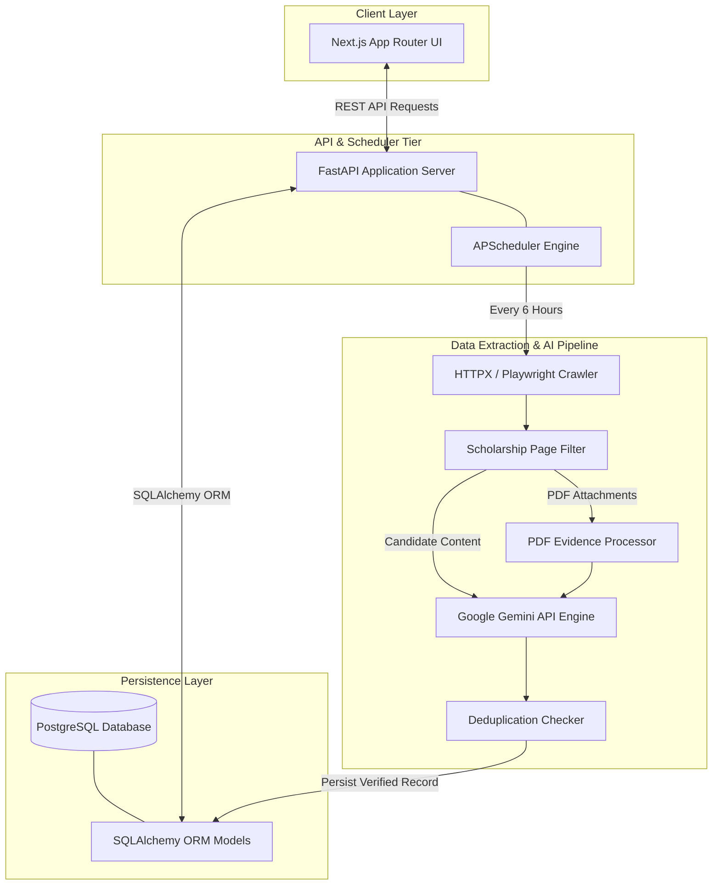

# ScholarScout AI — Master Engineering & Project Handbook (`PROJECT-HANDBOOK.md`)

This handbook serves as the **deep technical source of truth** for **ScholarScout AI**. It contains complete architectural breakdowns, code traceability maps, database ERDs, execution lifecycles, and operational procedures based on an audit of the repository.

---

## 1. Executive Summary

ScholarScout AI is an automated ETL data extraction engine, scheduled background discovery system, and web management dashboard built to aggregate international scholarship announcements from Chinese university websites (`.edu.cn`). The platform combines pre-filtering heuristics with Google Gemini LLM processing to turn unstructured web markup and PDF attachments into structured scholarship metadata.

---

## 2. Project Purpose

University scholarship portals across China frequently post notices across fragmented subdomains with unstructured HTML tables, mixed Chinese/English announcements, and downloadable PDF attachments. Manual tracking is inefficient and leads to missed deadlines. ScholarScout AI automates the discovery, extraction, deduplication, validation, and presentation of scholarship opportunities.

---

## 3. Functional Scope

### Implemented
* **Automated Source Discovery (24-Hour Task):** Scans Chinese higher-education domains (`.edu.cn`) and seeds valid portals into the source queue.
* **Extraction Pipeline (6-Hour Task):** Crawls queued university sources using HTTPX/Playwright, pre-filters candidate content, parses metadata using Gemini API, and extracts embedded PDF evidence.
* **Deduplication Engine:** Generates SHA-256 hashes from scholarship attributes to prevent duplicate database writes.
* **REST API Gateway:** Exposes FastAPI endpoints for querying scholarships, fetching metrics, and monitoring source states.
* **Web Dashboard:** Provides a responsive Next.js App Router UI with search, degree/funding filtering, detail views, and real-time scheduler tracking.

### Missing / Not Implemented
* **Authentication & Authorization:** API endpoints and queue triggers are currently public (unauthenticated).
* **Payment / Monetization:** Not present in the codebase.
* **Notification System:** Email or push notification mechanisms are not implemented.

---

## 4. Technology Stack

| Layer | Technology | Version | Purpose |
| :--- | :--- | :--- | :--- |
| **Frontend UI** | Next.js (App Router, TypeScript) | 15.0+ | Responsive web interface & client dashboard |
| **Styling** | Tailwind CSS, Lucide React, Shadcn UI | Latest | Modern UI layout & icon system |
| **Backend API** | FastAPI (Python) | 3.11+ | Asynchronous REST API framework |
| **Task Scheduler** | APScheduler (`AsyncIOScheduler`) | 3.10+ | Embedded background job orchestration |
| **AI Extraction Engine** | Google Gemini API (`google-generativeai`) | 1.5-flash / pro | Structured JSON extraction from unstructured web/PDF text |
| **Database & ORM** | PostgreSQL, SQLAlchemy, Alembic | 2.0+ (ORM) | Relational database persistence & schema migrations |
| **HTTP Crawling** | HTTPX, BeautifulSoup4, Playwright | Latest | Web page crawling and dynamic SPA rendering |
| **Testing** | Pytest, pytest-asyncio | 8.0+ | Backend unit and integration testing suite |

---

## 5. Complete Architecture



---

## 6. Repository Structure

```text
ScholarScout-AI/
├── backend/
│   ├── app/
│   │   ├── api/routes/          # REST API endpoints (scholarships, sources)
│   │   ├── config/              # Pydantic environment configurations
│   │   ├── database/            # Database session setup
│   │   ├── models/              # SQLAlchemy ORM models
│   │   ├── schemas/             # Pydantic validation schemas
│   │   ├── scripts/             # Standalone runner scripts
│   │   ├── services/
│   │   │   ├── automation/      # Discovery manager and source validators
│   │   │   ├── extraction/      # Gemini AI prompt extraction
│   │   │   ├── filters/         # Page pre-filtering heuristics
│   │   │   ├── pdf/             # PDF downloaders & text processors
│   │   │   └── scheduler/       # APScheduler service and jobs
│   │   └── main.py              # Application entrypoint & lifespan context
│   ├── migrations/              # Alembic database migration scripts
│   ├── tests/                   # Pytest test suite
│   ├── pytest.ini               # Pytest configuration
│   └── requirements.txt         # Backend Python dependencies
└── frontend/
    ├── app/                     # Next.js App Router pages (/ and /scholarships/[id])
    ├── components/              # Modular UI React components
    ├── services/                # Frontend API client (scholarshipService.ts)
    ├── types/                   # TypeScript interface definitions
    └── package.json             # Frontend Node.js dependencies
```

---

## 7. Frontend Architecture

* **Routing:** File-system routing using Next.js App Router (`app/page.tsx`, `app/scholarships/[id]/page.tsx`).
* **State Hydration:** Client state managed inside `components/scholarships/DashboardClient.tsx` using `useState` and `useEffect`.
* **API Service Layer:** Isolated inside `frontend/services/scholarshipService.ts` targeting `NEXT_PUBLIC_API_BASE_URL`. Includes fallback mock datasets (`mock/scholarships.ts`) if the live API drops.

---

## 8. Backend Architecture

* **Lifespan Initialization:** `app/main.py` instantiates FastAPI with a lifespan context manager that initializes database tables (`Base.metadata.create_all`) and starts `APScheduler` upon boot.
* **Dependency Injection:** Database sessions yielded safely via `get_db` generator in `app/dependencies/__init__.py`.

---

## 9. API Architecture

Exposed under path prefix `/api/v1`:
* `GET /api/v1/scholarships`: Paginated/filtered search list.
* `GET /api/v1/scholarships/stats`: Pipeline and database metrics.
* `GET /api/v1/scholarships/{id}`: Detailed view for a single scholarship.
* `GET /api/v1/sources`: List of active crawler sources.

---

## 10. Database Architecture & ERD

```mermaid
erdiagram
    scholarships {
        uuid id PK
        string title
        string university
        string degree_level
        string funding_type
        text funding_details
        string deadline
        string application_url
        text summary
        json requirements
        string source_url
        string content_hash UK
        timestamp created_at
        timestamp updated_at
    }

    sources {
        uuid id PK
        string url UK
        string name
        string status
        timestamp last_checked_at
        integer check_interval_hours
        integer failure_count
        timestamp created_at
        timestamp updated_at
    }
```

---

## 11. Complete Data Model

### `scholarships` Table
* `id` (UUID, Primary Key)
* `title` (String 255, Not Null)
* `university` (String 255, Not Null)
* `degree_level` (String 50, Not Null)
* `funding_type` (String 50, Not Null)
* `funding_details` (Text, Nullable)
* `deadline` (String 100, Nullable)
* `application_url` (String 500, Nullable)
* `summary` (Text, Nullable)
* `requirements` (JSON, Nullable, Default: `[]`)
* `source_url` (String 500, Not Null)
* `content_hash` (String 64, Unique, Not Null)
* `created_at` / `updated_at` (Timestamp)

### `sources` Table
* `id` (UUID, Primary Key)
* `url` (String 500, Unique, Not Null)
* `name` (String 255, Nullable)
* `status` (String 50, Default: `'active'`)
* `last_checked_at` (Timestamp, Nullable)
* `check_interval_hours` (Integer, Default: 6)
* `failure_count` (Integer, Default: 0)
* `created_at` / `updated_at` (Timestamp)

---

## 12. Business Logic & Extraction Pipeline

```text
Raw Portal HTML
  ↓
Pre-Filter Evaluation (app/services/filters/scholarship.py)
  ↓ Score calculation via keyword regex matching ('scholarship', 'grant', 'funding')
Candidate Page Accepted
  ↓
Gemini API Extraction (app/services/extraction/openai_extractor.py)
  ↓ Generates structured JSON metadata
Deduplication Check (app/services/duplicate_checker/repository.py)
  ↓ Calculates SHA-256 hash across title, university, and deadline
Persist to PostgreSQL Database
```

---

## 13. External Integrations

| External Service | Purpose | Integration Module |
| :--- | :--- | :--- |
| **Google Gemini API** | Structured LLM extraction from HTML/PDF text | `backend/app/services/extraction/openai_extractor.py` |
| **Chinese University Portals** | Web page crawling and announcement retrieval | `backend/app/services/connectors/university.py` |

---

## 14. Background Jobs & Scheduling

Embedded `APScheduler` (`AsyncIOScheduler`) handles background processing:
1. **Source Discovery Job (`run_scheduled_source_discovery`):** Executes every 24 hours to locate `.edu.cn` university portals.
2. **Scholarship Extraction Job (`run_scheduled_discovery`):** Executes every 6 hours to fetch due sources from the processing queue.

---

## 15. Configuration & Environment Variables

### Backend (`backend/.env`)
* `DATABASE_URL`: PostgreSQL connection string.
* `GEMINI_API_KEY`: API key for Google Gemini Generative AI.
* `PYTHONPATH`: Base Python path (`.`).

### Frontend (`frontend/.env.local`)
* `NEXT_PUBLIC_API_BASE_URL`: Public backend REST API URL (`http://localhost:8000/api/v1`).

---

## 16. Code Traceability Matrix

### Feature: Scholarship Dashboard & Search
* **Frontend:** `frontend/components/scholarships/DashboardClient.tsx`
* **API Route:** `GET /api/v1/scholarships` (`backend/app/api/routes/scholarships.py`)
* **Service:** `backend/app/database/database.py` (`get_db`)
* **ORM Model:** `Scholarship` (`backend/app/models/scholarship.py`)
* **Tests:** `backend/tests/test_main.py`

### Feature: Pre-Filtering Engine
* **Service:** `backend/app/services/filters/scholarship.py`
* **Tests:** `backend/tests/test_filter.py`, `backend/tests/test_actual_filter.py`

### Feature: AI Extraction Pipeline
* **Service:** `backend/app/services/extraction/openai_extractor.py`
* **Schema:** `backend/app/schemas/pipeline.py`
* **Tests:** `backend/tests/test_pdf_extraction_gemini.py`

---

## 17. Codebase Audit & Technical Risk Assessment

### Implemented Functionality
* Automated discovery, queue management, pre-filtering, Gemini extraction, deduplication, REST API endpoints, and Next.js UI dashboard.

### Missing Functionality
* User authentication and authorization controls on REST API endpoints.
* Rate-limiting middleware on public API routes.

### Technical Debt & Risks
* **Embedded Scheduler Scaling:** Running APScheduler inside the web API instance shares compute resources. If task volume scales significantly, background workers should be offloaded to Celery/Redis.
* **Unenforced Foreign Key Constraints:** `Scholarship` and `Source` tables are logically linked without DB-level foreign key constraints.

---

## 18. Documentation Verification & Audit Summary

* **What Was Inspected:** Complete repository files including `backend/app/`, `frontend/`, Alembic migrations, Pytest modules, configuration settings, and package manifests.
* **Inconsistencies Discovered:** None.
* **Undocumented Functionality:** Standalone script `backend/app/scripts/run_discovery.py` can be executed via CLI to trigger extraction cycles out-of-band.
